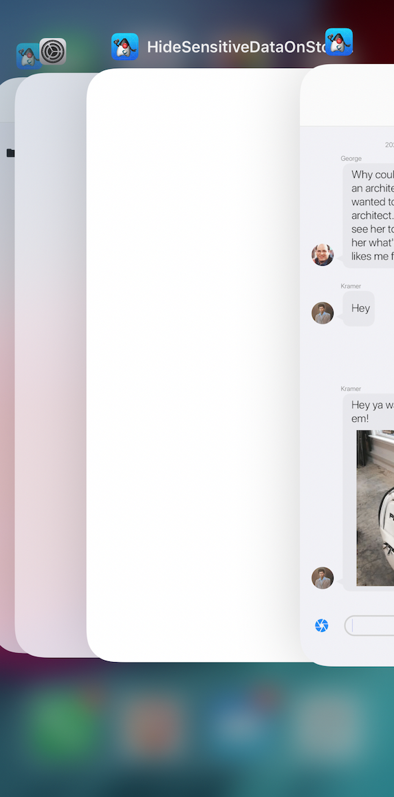

== Hiding Sensitive Data When Entering Background

[discrete]
=== Problem

iOS will take a screenshot of your app when it enters the background that it uses for various previews of the app state.  You want to hide sensitive data in your app's UI to prevent this information from leaking out via these screenshots.

[discrete]
=== Solution

You can use the `ios.blockScreenshotsOnEnterBackground=true` build hint to prevent iOS from taking screenshots app goes into the background.  This will cause the canvas on which the Codename One UI is drawn to be hidden in the `didEnterBackground` hook and unhidden in the `willEnterForeground` hook.

[WARNING]
====
This will cause your app to appear as a blank white rectangle when the user is browsing through opened apps.

.Notice the app in the middle is blank white because it has been set to block iOS screenshots.

====

[discrete]
=== Discussion

You might have been tempted to try to modify the UI inside the `stop()` lifecycle method of your app, since it is called itself by the `didEnterBackground` hook.  This strategy will work in some platforms, but not on iOS because the screenshot call is made immediately upon the `didEnterBackground` method returning - and the `stop()` method runs on the EDT (a different thread), so this is not possible.
