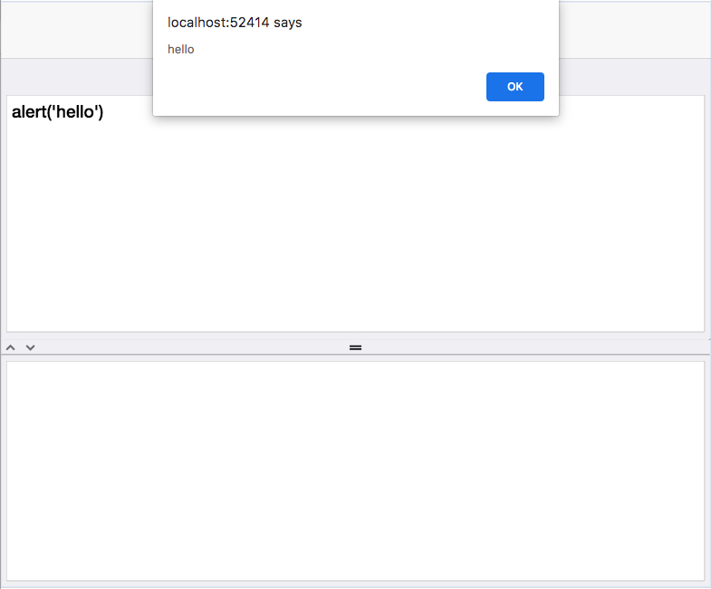

== Sending Messages to Outside Webpage

[discrete]
=== Problem

You need to communicate back and forth between the Codename One app and the webpage that contains it.

[discrete]
=== Solution

There are two sides to this problem:

. Sending messages from Codename One to the outside webpage.
. Sending messages from the Outside webpage to Codename One.

For the first case (sending messages to the outside webpage), you can use `CN.postMessage()`, in Codename One to send the message.  The message will be dispatched to Javascript event listeners in the outside webpage that register to receive 'cn1outbox' events.

.Sending a message from Codename One to the outside webpage.
[source,java]
----
MessageEvent message = new MessageEvent(
    null,        // event source... we'll leave it null
    "Hello",     // The message to deliver
    0            // Optional message code.  
);
//Dispatch the message
CN.postMessage(message);
----

Alternatively, you can use `Display.getSharedJavascriptContext()` to obtain a https://www.codenameone.com/javadoc/com/codename1/ui/BrowserComponent.html[BrowserComponent] that encapsulates the Browser environment that the app is running in.  This offers a little bit more flexibilty than `postMessage()` as you can run arbitrary Javascript comments

.Example using `getSharedJavascriptContext()` to interact with the browser environment
[source,java]
----
Form hi = new Form("Hi World", new BorderLayout());
TextArea input = new TextArea();
TextArea output = new TextArea();
output.setEditable(false);

Button execute = new Button("Run");
execute.addActionListener(evt->{
    BrowserComponent bc = CN.getSharedJavascriptContext().ready().get();
    bc.execute("callback.onSuccess(window.eval(${0}))", new Object[]{input.getText()}, res->{
        output.setText(res.toString());
    });
});
SplitPane split = new SplitPane(SplitPane.VERTICAL_SPLIT, input, output, "0", "50%", "99%");
hi.add(CENTER, split);
hi.add(NORTH, execute);

hi.show();
----

.Receiving messages from Codename One in outside webpage.
[source,javascript]
----
window.addEventListener('cn1outbox', function(evt) {
    var message = evt.detail;
    var code = evt.code;
    ...
});
----

